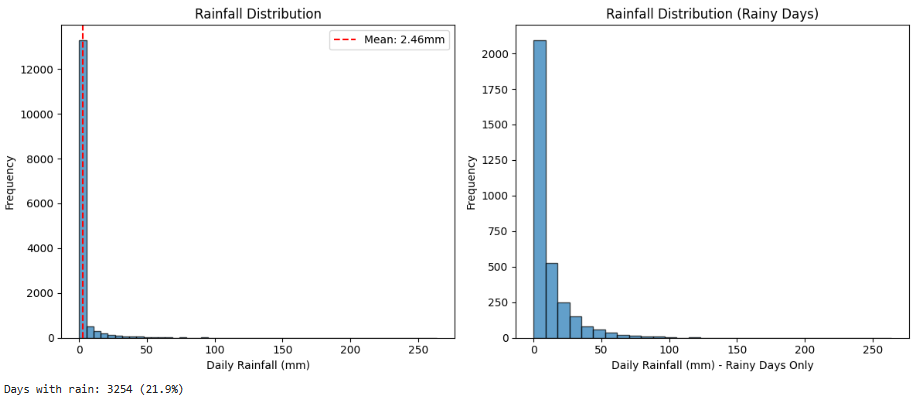
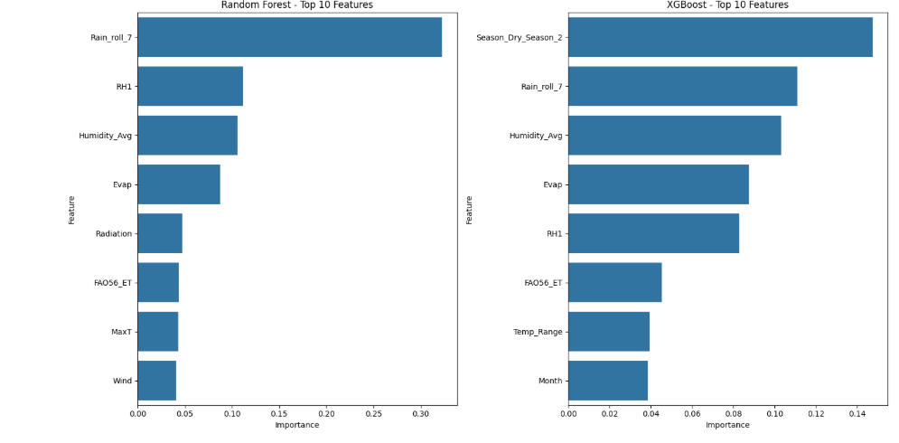
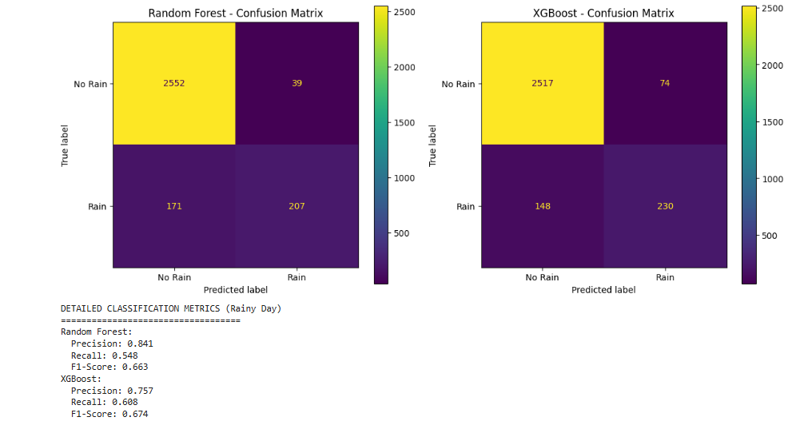

# Data-Driven Irrigation Prediction for Smart Farming

**Machine Learning - Final Group Project**  
**Predicting Monthly Irrigation Needs Using Historical Weather Data**

## 📋 Project Overview

This project develops a machine learning solution to predict whether irrigation will be needed in the **next month** based on historical weather patterns. It addresses water management challenges in semi-arid regions, relevant to Kenyan agriculture (ASAL areas).

We used a **40-year daily weather dataset** (ICRISAT, India) as a proxy due to its completeness and similarity to Kenyan climatic conditions. The solution combines **Exploratory Data Analysis (EDA)**, **feature engineering**, **classical ML models**, and a **deep learning (LSTM)** baseline.

**Key Goal**: Help farmers make proactive decisions on water usage, reduce crop stress, and optimize limited resources.

### 🎯 Objectives

- Perform thorough data cleaning and EDA on time-series weather data.
- Engineer relevant time-series features (lags, rolling statistics, seasonal indicators).
- Build and compare multiple models for binary classification (`Irrigation_Needed`).
- Evaluate using classification metrics suitable for imbalanced data (F1-score, ROC-AUC, Recall).
- Discuss real-world applicability and limitations.

## 📊 Dataset

- **Source**: ICRISAT 40-year daily weather data (India)
- **Time Span**: ~14,600 daily records → aggregated to ~480–500 monthly records
- **Key Variables**: Max/Min Temperature, Humidity, Wind Speed, Rainfall, Radiation, Evapotranspiration (ET0), Sunshine, etc.
- **Target**: Binary `Irrigation_Needed` (0 = No, 1 = Yes) based on Net Water Demand (`ET0 - Rainfall`).

**Challenges Addressed**:

- Highly skewed rainfall distribution (many dry days, rare heavy events).
- Small sample size after monthly aggregation (limits deep learning performance).
- Time-series nature (prevented data leakage via TimeSeriesSplit).

## 🛠️ Methodology

### 1. Data Preparation & EDA

- Handled missing values (forward/backward fill + mean imputation).
- Outlier capping.
- Visualized distributions, correlations, skewness, and seasonal patterns.
- Aggregated daily data to monthly level.

### 2. Feature Engineering

- **Lag features** (1–12 months).
- **Rolling statistics** (3, 7, 30-day windows for mean/sum).
- **Derived features**: Net Water Demand, Temperature Range, Seasonal encodings (sin/cos).
- Time-based features for seasonality.

### 3. Modeling

- **Classical ML**: Logistic Regression (baseline), Random Forest, **LightGBM** (best performer), XGBoost.
- **Deep Learning**: LSTM with sequence input.
- **Validation**: TimeSeriesSplit + train/validation/test split to respect temporal order.
- **Hyperparameter Tuning**: RandomizedSearchCV.

### 4. Evaluation

- Primary metrics: **F1-score**, **ROC-AUC**, Recall (Class 1), Precision.
- Confusion matrices, ROC curves.
- Comparison of training vs validation behavior to detect overfitting.

**Best Model**: **LightGBM** — excellent balance of performance, speed, and generalization on this tabular time-series dataset.

## 📈 Results

- LightGBM achieved strong F1-score and ROC-AUC on the test set.
- Tree-based ensembles outperformed LSTM (expected due to limited data size).
- Model captures seasonal patterns well but struggles with rare extreme events (typical for skewed rainfall data).

**Screenshots** (add these to your repo):

1. **EDA** – Rainfall distribution / correlation heatmap.
2. **Feature Importance** (from LightGBM).
3. **Model Comparison Table** + Confusion Matrix / ROC Curve.

### Visualizations

  

    <strong>EDA - Rainfall Distribution</strong> 
    
  

  

    <strong>Model Comparison</strong> 
    
  

  

    <strong>Confusion Matrix</strong> 
    
  

## 🗂️ Repository Structure
